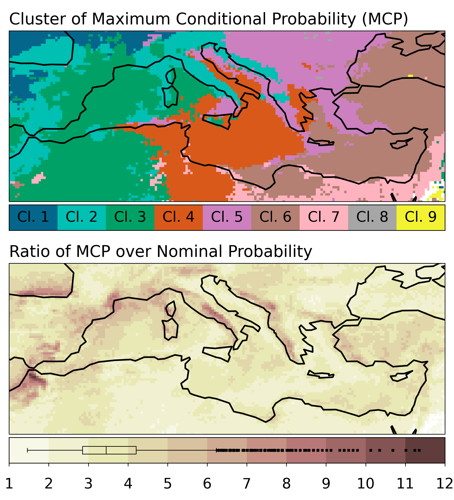

# Scripts for "Extreme precipitation events in the Mediterranean: Spatiotemporal characteristics and connection to large-scale atmospheric flow patterns"

This repository reproduces the analysis and figures presented in ["Extreme precipitation events in the Mediterranean: Spatiotemporal characteristics and connection to large-scale atmospheric flow patterns"](https://doi.org/10.1002/joc.6985) (Nikolaos Mastrantonas, Pedro Herrera-Lormendez, Linus Magnusson, Florian Pappenberger, Jörg Matschullat).

The data used for this study are available from:
1. ECMWF MARS server (https://www.ecmwf.int/en/forecasts/datasets/archive-datasets)
2. Copernicus Climate Data Store (https://surfobs.climate.copernicus.eu/dataaccess/access_eobs.php)

There are 4 scripts for reproducing the analysis and the figures (located in the *Scripts* subfolder). More specifically:
- **Script1 Data Download.ipynb**: Data download *!Note that depending the authorization, the data might have to be downloaded differently, and non-trivial changes in the script might be needed!*
- **Script2 Data Analysis.ipynb**: Main data analysis for this study 
- **Script3 Additional Data Analysis.ipynb**: Additional analysis, mainly for the appendix
- **Script4 Data Plotting.ipynb**: Script for plotting the figures of this study

Note that, for all scripts the filepaths should be amended (the existing parent directory is the one that contains the scripts). For convenience, the files needed for the plots (generated by *Script2* and *Script3*) are also available in the *DataForPlots* subfolder, so that the *Script4* can be executed independently.

 *Please consult the paper for further information regarding the methodology.*  

All code is authored by Nikolaos Mastrantonas, researcher at [ECMWF](https://www.ecmwf.int/), UK and Ph.D. student at [TU Bergakademie Freiberg](https://tu-freiberg.de/), Germany. The code was developed during employment at ECMWF, using ECMWF resources.

Comments, suggestions, etc. regarding the scripts and/or the paper are more than welcome!

Contact details:
- Email: nikolaos.mastrantonas@ecmwf.int; nikolaos.mastrantonas@doktorand.tu-freiberg.de
- Twitter: https://twitter.com/NikMastrantonas

  

  This work is part of the Climate Advanced Forecasting of sub-seasonal Extremes project ([CAFE](http://www.cafes2se-itn.eu/)). The project has received funding from the European Union’s Horizon 2020 research and innovation programme under the Marie Skłodowska-Curie grant agreement No 813844.

##  Graphical Abstract 
# Extreme precipitation events in the Mediterranean: Spatiotemporal characteristics and connection to large-scale atmospheric flow patterns
Nikolaos Mastrantonas*, Pedro Herrera-Lormendez, Linus Magnusson, Florian Pappenberger, Jörg Matschullat

 
This study analyses the spatiotemporal characteristics of extreme precipitation events over the Mediterranean, and their connection to large-scale atmospheric flow patterns. It is shown that by conditioning the extremes based on the atmospheric variability in the low- and mid-troposphere, their probability increases more than threefold, when using 9 clusters to group all the synoptic daily patterns. These connections can support extended-range forecasts, as for such lead times NWP models are more skillful in predicting large-scale patterns than localized extremes.
